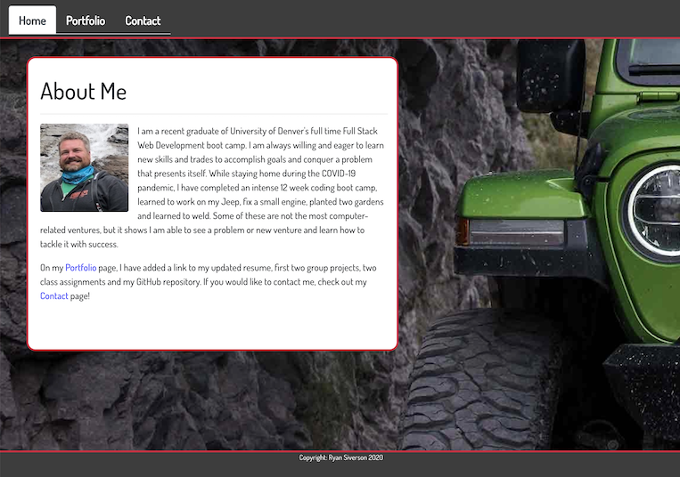

## Table of Contents
##### 1. [Project Description](#Project-Description)
##### 2. [Heroku Address](#GitHub-Address)
##### 3. [License Type](#License-Type)
##### 4. [Dependencies](#Dependencies)
##### 5. [Test Run Commands](#Test-Run-Commands)
##### 6. [Author Contact Information](#Author-Contact-Information)
---
# **React Portfolio**

### **Project Description:**
##### This is my portfolio, recreated using React technologies.
---
### **Heroku Address:**
[React Portfolio](https://immense-atoll-22753.herokuapp.com/)
---
### **License Type:**
##### MIT

---
### **Dependencies**
##### npm i
---
### **Test Run Commands**
##### npm start
---
### **Image**

##### 
---
### **Author Contact Information:**

* Ryan Siverson
* rcsskier@mac.com
* [GitHub](https://github.com/rysiphoto)
* [LinkedIn](https://www.linkedin.com/in/ryan-siverson-695b5a32/)

---
---
###### © Ryan Siverson 2020
